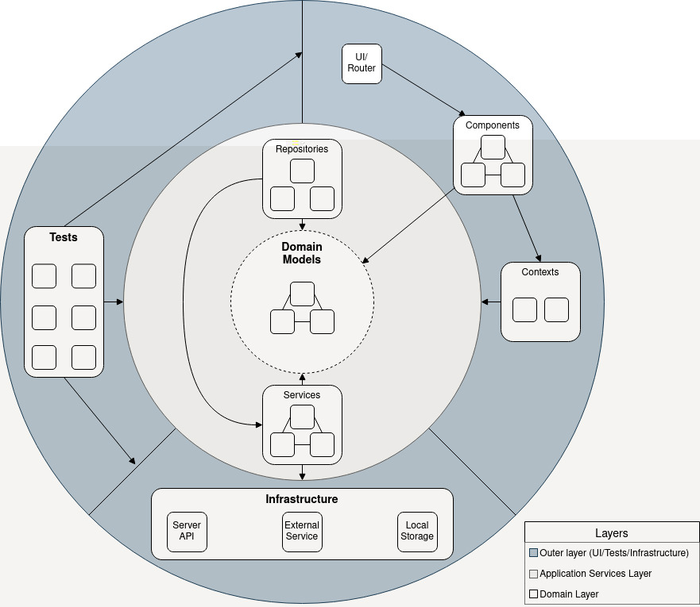

## Getting Started
### Requirement:
- Node ^8.11

### Running the App
- run `yarn install` in the folder repository
- run `yarn start` or `npm start` to start the app
- open `localhost:3000` in a browser to open the web app

### Development

The main goal of the current architecture is to increase maintainability, reusability, and adaptability of project components. So they can be used without React as the core. Overall architecture looks like this:



#### Src Folder Structure
```
src/
  /assets --- general assets of the project
  /components --- reusable react components
  /contexts --- react contexts for connecting to Application Service Layer
  /domains --- domains models and services
  /services --- application services, can connects application to Infrastucture
  /helpers --- stateless helper, pure function only
  /modules --- isolated ui folders, grouped by domain name
  /repositories --- services for handling domain data
```

#### .editorconfig
This project using [.editorconfig](./.editorconfig) for various typing configurations. Be sure to use an editor which supports it.

#### Linter
This project has 2 linter configurations: [one for development (.eslintrc.js)](.eslintrc.js) and [one for commit hook (.eslintrc.precommit.js)](.eslintrc.precommit.js) which inspect the working files before the files committed.

Development linter is less strict than the commit one. The main purpose of it is to help developers identify logical errors without disturbing them with unnecessary warnings of the experimental code which might not make it to the repository.

On the other hand, the commit linter is there to enforce good coding practice and increase readability of the code to help other developers understand the code better.

If your commit is cancelled because of a linter error, fix it and commit again. **Never force commit and skip the linter error unless in a critical situation**. Doing that will postpone the error to the next developer who will edit the code later. Discuss with the team if you think there is a rule which is not needed or obsolete.
